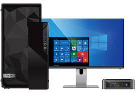

# Nvidia driver update & GPU 

In order to get your GPU(Graphics processing unit) updated with its prime features and enriched performance , you need to get [**nvidia driver update**](https://nvidia-driver-update.github.io/) . Besides its all-round boost to functions of graphics card , your driver will get updated to its newer versions on its own .
Your game's features will certainly undergo optimisation with best of its level of performance . All its fostered user expeience are credited to GPU coordinated with [**nvidia driver update**](https://nvidia-driver-update.github.io/) without a hitch .

## Mechanism of Nvidia Driver update functioning 

After [**NVIDIA driver update**](https://nvidia-driver-update.github.io/) is installed :- 

* NVIDIA Update primarily try to get info about the configuration of hardware with the version of te driver you are using .

* This is done in order to decide proper driver for your NVIDIA GPUs .

* Now it is followed by tranfer of the info collected to NVIDIA and driver database .

* Further , you need to configure following :-

1.No. of times you want updtes to be checked

2.Approval for beta driver notifications

3.Approval for system tray balloon notifications

## Ways to Configure NVIDIA Driver Update

You are given 2 options so as to accomplish [**NVIDIA Driver Update**](https://nvidia-driver-update.github.io/):-

**(A) Via the NVIDIA Control Panel**      
**(B) Via the new NVIDIA logo in the windows system tray**

### (A)Via the NVIDIA Control Panel 
1.You need to Right-click on the windows desktop 

2.Opt NVIDIA Control Panel

3.Go Help menu and select Updates

4.Then **Configure NVIDIA Update - Windows System Tray**

 
### B)Via the new NVIDIA logo in the windows system tray
1.The logo need a Right-click 

2.Opt Check for updates or Update preferences

3.Update **NVIDIA Control Panel - Preferences Tab**

 Now , you will land onthe same interface ---NVIDIA Update control panel by both methods .

 
#### 1.On the preferences tab

1.You need to Enable and disable NVIDIA Update.

2.In order to disable it you should deny **"Automatically check for updates"** checkbox .

3.Select the frequency for which you want update to be checked.

4.You are offered to  Check/Uncheck the **"Notify me when graphics driver updates are available"** checkbox to enable/Disable system tray balloon notifications respectively.

5.Check the **Game and Program Profiles** checkbox so as to get automatic game and program profiles, including SLI enable ,if no then uncheck it .

#### 2.On the Updates tab 

Click the Check for Updates button to get latest update info.

### Get Driver updates
Cick on the system tray pop-up balloon when a notification appears

***OR***

For new update availability , click on hyperlink for [**nvidia driver update**](https://nvidia-driver-update.github.io/) .

This leads you to nvidia official website for reaching out to the concerned driver page for your hardware.

 

 
 
 
 

